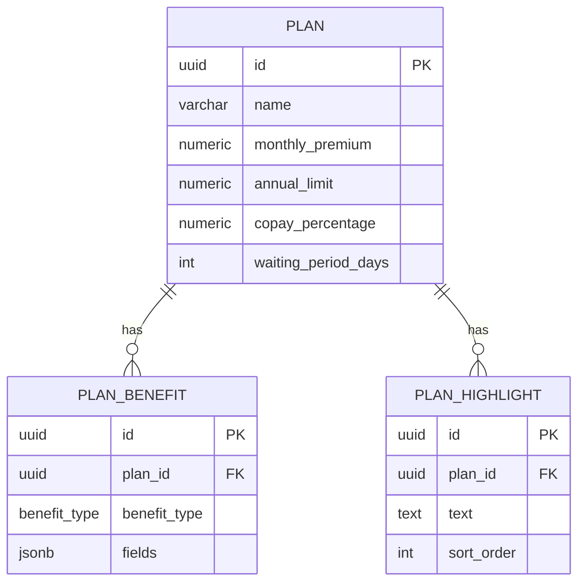

# Phase 3 — ERD

This challenge has no live database — all data is static JSON on the frontend. The sections below document (1) the frontend data shape and (2) how it would map to PostgreSQL if persistence were added.

---

## Frontend Data Shape

```typescript
enum BenefitType {
  Outpatient = "outpatient",
  Inpatient  = "inpatient",
  Dental     = "dental",
  Maternity  = "maternity",
}

type BenefitFields = {
  limit_per_visit?:     number; // outpatient  (-1 = unlimited)
  visits_per_year?:     number; // outpatient  (-1 = unlimited)
  limit_per_day?:       number; // inpatient   (-1 = unlimited)
  days_per_year?:       number; // inpatient   (-1 = unlimited)
  limit_per_year?:      number; // dental
  limit_per_pregnancy?: number; // maternity
};

type Benefit = BenefitFields | null; // null = not included in this plan

type Plan = {
  name: string;
  monthly_premium: number;
  annual_limit: number;
  benefits: Record<BenefitType, Benefit>; // enum as key = type-safe + iterable
  copay_percentage: number;               // 0–100
  waiting_period_days: number;
  highlights: string[];
};
```

Using `BenefitType` as the key type of `Record` gives compile-time safety (no typos, exhaustive switch statements) while still allowing iteration over all benefit rows at runtime.

---

## Relational Model (PostgreSQL equivalent)



### PostgreSQL schema notes

```sql
CREATE TYPE benefit_type AS ENUM ('outpatient', 'inpatient', 'dental', 'maternity');

CREATE TABLE plan_benefits (
  id           UUID PRIMARY KEY,
  plan_id      UUID NOT NULL REFERENCES plans(id),
  benefit_type benefit_type NOT NULL,
  fields       JSONB,          -- NULL means benefit not included in this plan
  UNIQUE (plan_id, benefit_type)
);
```

- **Why `ENUM` not `VARCHAR`?** The DB enforces valid values at the constraint level; adding a new type is a single non-destructive migration (`ALTER TYPE benefit_type ADD VALUE 'vision'`).
- **Why `JSONB` for fields?** Each benefit type has a different set of sub-fields (outpatient ≠ maternity). JSONB avoids a wide nullable table or a separate table per type, while still being indexable and queryable.
- **Mirror on the frontend:** The TypeScript `BenefitType` enum mirrors the PostgreSQL `benefit_type` enum exactly — one source of truth per layer, easy to keep in sync.

---

## Notes

- `-1` in any numeric field means **unlimited**; the UI renders it as `"Unlimited"`.
- `null` on a `Benefit` object means the benefit is **not included**; the UI renders a visual "Not included" indicator.
- Currency is not specified in the challenge brief; numeric values render as-is.
- The "Recommended" badge and per-row best-value highlights are computed at render time — no pre-computed flags in the data.
