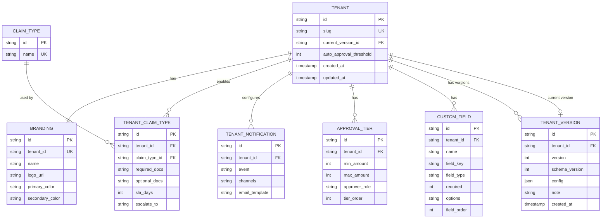

# 3. ERD / Data Shape

Strategy: **Hybrid** — normalized live tables for current state, JSON snapshot in `TENANT_VERSION` for history. See `plans/docs/STRATEGY_HYBRID.md` for full rationale.

---

## Entity Relationship Diagram



---

## Notes

### Live tables (current state)
- `TENANT.slug` — URL-friendly identifier (e.g. `safeguard-insurance`). Unique across all tenants.
- `TENANT.auto_approval_threshold` — claims below this amount are auto-approved; 0 means all claims require manual review.
- `TENANT.current_version_id` — FK pointer to the latest `TENANT_VERSION` row. Updated on every save. Avoids a `MAX(version)` subquery on every read.
- `BRANDING.tenant_id` — unique FK (one branding record per tenant). Updated in place when branding changes; history is preserved in `TENANT_VERSION.config`.
- `CLAIM_TYPE` — global platform master list (OUTPATIENT, INPATIENT, DENTAL, MATERNITY, OPTICAL). Shared across all tenants; tenants opt in via `TENANT_CLAIM_TYPE`.
- `TENANT_CLAIM_TYPE` — one row per enabled claim type per tenant. Holds tenant-specific SLA (`sla_days`), escalation contact, and required/optional document lists.
- `TENANT_NOTIFICATION` — one row per notification event per tenant (max 4 rows). Unique constraint on `(tenant_id, event)`. `email_template` is nullable — null means use the platform default.
- `APPROVAL_TIER` — one row per tier per tenant. `max_amount` is nullable — null means no upper bound (the highest tier). `tier_order` preserves display order.
- `CUSTOM_FIELD.field_type` — renamed from `type` to avoid conflict with the SQL reserved word.
- `CUSTOM_FIELD.required` — boolean stored as `int` (1 = required, 0 = optional).

### Version history (`TENANT_VERSION`)
- `TENANT_VERSION.version` — auto-incrementing integer scoped per tenant (tenant A's versions: 1, 2, 3 … independently of tenant B's).
- `TENANT_VERSION.config` — a **derived, self-contained JSON snapshot** of the full tenant state at the moment of save. Includes all live table data (branding, approval tiers, claim types, notifications, custom fields). Never used as the source of truth for current state — the live tables are.
- `TENANT_VERSION.schema_version` — integer tracking the shape of the `config` JSON. Incremented on breaking changes. Used by the migration layer to transform old snapshots at read time.
- `TENANT_VERSION.note` — optional human-readable label (e.g. "Added OPTICAL claim type").
- **Rollback** — reads the target `TENANT_VERSION.config`, replays it into the live tables, and inserts a new `TENANT_VERSION` row. History is append-only; no rows are ever mutated or deleted.

### Column types (diagram limitations)
`required_docs`, `optional_docs`, `channels`, and `options` are stored as PostgreSQL `text[]` arrays — shown as `string` in the diagram due to Mermaid syntax constraints.

---

## Version Snapshot — `config` JSON Shape

The `config` column is a point-in-time snapshot derived from the live tables at save time. It is read for history display and rollback only.

```ts
type VersionConfig = {
  schemaVersion: number             // incremented on breaking shape changes
  branding: {
    name: string
    logoUrl: string
    primaryColor: string
    secondaryColor: string
  }
  autoApprovalThreshold: number
  approvalTiers: Array<{
    minAmount: number
    maxAmount: number | null
    approverRole: string
    tierOrder: number
  }>
  claimTypes: Array<{
    type: ClaimType
    requiredDocs: string[]
    optionalDocs: string[]
    slaDays: number
    escalateTo: string
  }>
  notifications: Array<{
    event: NotificationEvent
    channels: NotificationChannel[]
    emailTemplate: string | null
  }>
  customFields: Array<{
    name: string
    fieldKey: string
    type: "text" | "number" | "select"
    required: boolean
    options: string[]
    fieldOrder: number
  }>
}

type ClaimType         = "OUTPATIENT" | "INPATIENT" | "DENTAL" | "MATERNITY" | "OPTICAL"
type NotificationEvent = "claim_submitted" | "approved" | "rejected" | "payment_sent"
type NotificationChannel = "email" | "sms" | "webhook"
```

---

## Sample Snapshot — SafeGuard Insurance (version 1)

```json
{
  "schemaVersion": 1,
  "branding": {
    "name": "SafeGuard Insurance",
    "logoUrl": "",
    "primaryColor": "#1D4ED8",
    "secondaryColor": "#93C5FD"
  },
  "autoApprovalThreshold": 20000,
  "approvalTiers": [
    { "minAmount": 20000, "maxAmount": 100000, "approverRole": "assessor",  "tierOrder": 1 },
    { "minAmount": 100000, "maxAmount": 500000, "approverRole": "team_lead", "tierOrder": 2 },
    { "minAmount": 500000, "maxAmount": null,   "approverRole": "director",  "tierOrder": 3 }
  ],
  "claimTypes": [
    {
      "type": "OUTPATIENT",
      "requiredDocs": ["medical_receipt", "diagnosis_note"],
      "optionalDocs": ["referral_letter", "lab_results"],
      "slaDays": 5,
      "escalateTo": "claims_manager"
    },
    {
      "type": "INPATIENT",
      "requiredDocs": ["admission_record", "discharge_summary", "itemized_bill", "doctors_report"],
      "optionalDocs": ["lab_results"],
      "slaDays": 10,
      "escalateTo": "director"
    },
    {
      "type": "DENTAL",
      "requiredDocs": ["dental_receipt", "treatment_plan"],
      "optionalDocs": ["xray_images"],
      "slaDays": 5,
      "escalateTo": "claims_manager"
    }
  ],
  "notifications": [
    { "event": "claim_submitted", "channels": ["email"], "emailTemplate": null },
    { "event": "approved",        "channels": ["email"], "emailTemplate": null },
    { "event": "rejected",        "channels": ["email"], "emailTemplate": null },
    { "event": "payment_sent",    "channels": ["email"], "emailTemplate": null }
  ],
  "customFields": [
    {
      "name": "Employee ID",
      "fieldKey": "employee_id",
      "type": "text",
      "required": true,
      "options": [],
      "fieldOrder": 1
    }
  ]
}
```
