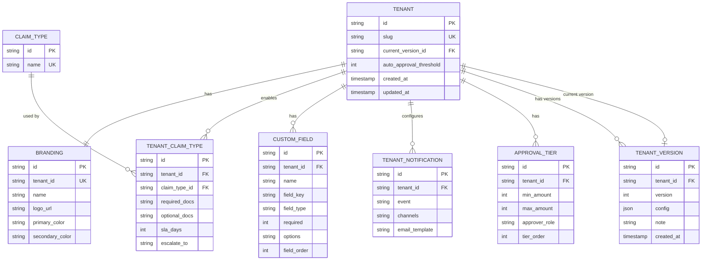

# Strategy C — Hybrid (Normalized Live State + JSON Version Snapshot)

Structured data that benefits from relational queries lives in normalized tables and represents the **current live state**. Complex nested config that is always read as a unit lives in a JSON column inside `TENANT_VERSION` and represents the **historical snapshot**. Every save writes to both: the live tables are updated, and a new `TENANT_VERSION` row is inserted capturing a full snapshot of everything.

---

## ERD



> **Note on column types:** `required_docs` and `optional_docs` in `TENANT_CLAIM_TYPE` are stored as PostgreSQL `text[]` arrays. `options` and `channels` in `CUSTOM_FIELD` and `TENANT_NOTIFICATION` are also `text[]`. `required` in `CUSTOM_FIELD` is a `boolean` stored as `int` (0/1) for diagram clarity. `field_type` is renamed from `type` to avoid conflict with the SQL reserved word. `email_template` in `TENANT_NOTIFICATION` is nullable — null means use the platform default template. Unique constraint on `(tenant_id, event)` in `TENANT_NOTIFICATION` — one row per event per tenant. `max_amount` in `APPROVAL_TIER` is nullable — null means no upper bound (the highest tier). `auto_approval_threshold` on `TENANT` defaults to 0 meaning all claims require manual review.

---

## Key Design Decisions

### What is normalized vs. what is in JSON

| Data | Where | Why |
|------|-------|-----|
| Branding | `BRANDING` table (1:1 with tenant) | Simple scalars; clean to query and update individually |
| Claim type master list | `CLAIM_TYPE` table (global) | Finite, predefined set (OUTPATIENT, INPATIENT, etc.); shared across all tenants |
| Enabled claim types + docs + SLA | `TENANT_CLAIM_TYPE` junction | Per-tenant, per-type settings; benefits from FK to `CLAIM_TYPE`; SLA is per-tenant |
| Custom fields | `CUSTOM_FIELD` table | Ordered list per tenant; needs field_order and per-field validation |
| Notifications | `TENANT_NOTIFICATION` table | One row per event per tenant (max 4 rows); consistent with how claim types and custom fields are modeled; queryable with standard SQL |
| Approval threshold | `TENANT.auto_approval_threshold` column | Single scalar per tenant; belongs to the tenant, not to any individual tier |
| Approval tiers | `APPROVAL_TIER` table | List of (minAmount, maxAmount, role) per tenant; same list pattern as notifications and claim types |

### SLA belongs to `TENANT_CLAIM_TYPE`, not `CLAIM_TYPE`

SLA is a commitment the **tenant** makes — not a property of the claim type itself. OUTPATIENT is 5 days for SafeGuard, 7 days for HealthFirst, and 15 days for GovHealth. Placing SLA on `CLAIM_TYPE` would force all tenants to share one value. Moving it to `TENANT_CLAIM_TYPE` makes it correctly per-tenant per-type.

### `CLAIM_TYPE` is a global master list

The five claim types (OUTPATIENT, INPATIENT, DENTAL, MATERNITY, OPTICAL) are platform-level constants, not tenant-specific. They live in a single `CLAIM_TYPE` table. Tenants opt in to specific types via `TENANT_CLAIM_TYPE`. Adding a new platform-wide claim type (e.g., MENTAL_HEALTH) is one row insert — no per-tenant changes needed until a tenant chooses to enable it.

### `BRANDING` is 1:1 with `TENANT`, updated in place

`BRANDING.tenant_id` is a unique FK — one branding record per tenant. When branding changes, the existing row is updated (not replaced). Branding history is not maintained in the `BRANDING` table; it is preserved in `TENANT_VERSION.config` snapshots.

### `TENANT_VERSION.config` is a self-contained snapshot

The `config` JSON column captures the **full state of the tenant** at the moment of save — including branding, enabled claim types with their docs and SLA, approval rules, notifications, and custom fields. This means a historical version can be read and understood without joining any live table. The snapshot is derived from the live tables at save time and is never mutated after insert.

### Live tables = current state, `TENANT_VERSION` = history

| Operation | Live tables | TENANT_VERSION |
|-----------|-------------|----------------|
| Read current config | Join TENANT + BRANDING + TENANT_CLAIM_TYPE + TENANT_NOTIFICATION + APPROVAL_TIER + CUSTOM_FIELD | — |
| Read historical version | — | Read TENANT_VERSION.config by version number (self-contained snapshot) |
| Save | UPDATE/INSERT live tables + INSERT new TENANT_VERSION row | — |
| Rollback | UPDATE live tables from target TENANT_VERSION.config + INSERT new TENANT_VERSION (rollback is a new version, not a mutation) | — |

---

## `config` JSON Shape

The `config` column in `TENANT_VERSION` stores a complete snapshot of the full tenant state at the moment of save — including all sections from the live tables (branding, claim types, notifications, approval tiers, custom fields). This ensures historical versions are self-contained and do not require joining live tables to reconstruct. There is no longer a JSON-only section — the `config` snapshot is derived entirely from the live tables at save time.

```ts
type VersionConfig = {
  branding: {
    name: string
    logoUrl: string
    primaryColor: string
    secondaryColor: string
  }
  autoApprovalThreshold: number
  approvalTiers: Array<{
    minAmount: number
    maxAmount: number | null
    approverRole: string
    tierOrder: number
  }>
  claimTypes: Array<{
    type: ClaimType
    requiredDocs: string[]
    optionalDocs: string[]
    slaDays: number
    escalateTo: string
  }>
  notifications: Array<{
    event: NotificationEvent
    channels: NotificationChannel[]
    emailTemplate: string | null
  }>
  customFields: Array<{
    name: string
    fieldKey: string
    type: "text" | "number" | "select"
    required: boolean
    options: string[]
    fieldOrder: number
  }>
}
```

---

## Save Flow

```
1. Validate incoming config with Zod schema
2. Begin DB transaction
   a. UPSERT BRANDING row for this tenant
   b. UPDATE TENANT.auto_approval_threshold
   c. DELETE existing APPROVAL_TIER rows for this tenant
      INSERT new rows for each tier (with tier_order)
   d. DELETE existing TENANT_CLAIM_TYPE rows for this tenant
      INSERT new rows for each enabled claim type (with docs + SLA)
   e. DELETE existing TENANT_NOTIFICATION rows for this tenant
      INSERT new rows for each configured notification event (with channels + template)
   f. DELETE existing CUSTOM_FIELD rows for this tenant
      INSERT new rows for each custom field (with field_order)
   g. INSERT TENANT_VERSION row with full config JSON snapshot + incremented version
   h. UPDATE TENANT.current_version_id to new TENANT_VERSION.id
3. Commit transaction
4. Invalidate config cache for this tenant
```

Steps c, d, e, and f use delete-and-reinsert rather than per-row diffing — simpler logic at the cost of slightly more DB writes. Acceptable at this data scale.

## Rollback Flow

```
1. Load target TENANT_VERSION.config by version number
2. Parse and validate with Zod schema
3. Run the same Save Flow using the target config as input
   (rollback creates a new version — it does not mutate history)
```

---

## Advantages

### 1. Fewer tables than pure normalization
8 tables instead of 13. Less Prisma model code, fewer repository functions, smaller test surface.

### 2. SLA and docs correctly scoped to tenant
`TENANT_CLAIM_TYPE` holds SLA days, escalation contact, and required/optional documents per tenant per claim type. This is the correct model — each tenant controls its own SLA commitments.

### 3. `CLAIM_TYPE` is a clean master list
Predefined claim types live in one place. Adding a new platform-wide type is one row. No per-tenant migration needed until a tenant enables it.

### 4. Current state is queryable with standard SQL
Finding all tenants with MATERNITY enabled and SLA ≤ 7 days is plain SQL on `TENANT_CLAIM_TYPE` — no JSON operators needed.

```sql
SELECT t.slug FROM tenant t
JOIN tenant_claim_type tct ON tct.tenant_id = t.id
JOIN claim_type ct ON ct.id = tct.claim_type_id
WHERE ct.name = 'MATERNITY'
  AND tct.sla_days <= 7
```

### 5. Version history is self-contained
`TENANT_VERSION.config` is a complete snapshot. Viewing or rolling back any historical version requires no joins to live tables — just read the JSON.

### 6. Notifications are consistent with other list-type tables
`TENANT_NOTIFICATION` follows the same pattern as `TENANT_CLAIM_TYPE` and `CUSTOM_FIELD` — one row per item per tenant, queryable with standard SQL. Finding all tenants that send SMS on `claim_submitted` is a plain indexed query with no JSON operators.

### 7. Everything is normalized — JSON is snapshot-only
All live data lives in typed columns. The `config` JSON in `TENANT_VERSION` is purely a derived snapshot for history — it is never the source of truth. This means the JSON blob carries no risk of drift from the live tables.

### 8. Custom fields are properly ordered and typed
`CUSTOM_FIELD` rows with `field_order` and typed columns give DB-level structure to what would otherwise be an opaque JSON array.

---

## Trade-offs

### 1. Dual write on every save
Every save writes to up to 4 live tables AND inserts a `TENANT_VERSION` row. All inside one transaction. If the transaction fails partway, nothing is committed — but the logic is more complex than a single-table write.

### 2. Rollback must update live tables
Rolling back a version is not just updating `current_version_id`. It requires deserializing the target `config` JSON and writing it back to the live tables. This is more code than the pure JSON blob approach where rollback is one row pointer change.

### 3. Branding history is only in `TENANT_VERSION.config`
The `BRANDING` table always reflects current branding. To see what branding looked like at version 3, you must read `TENANT_VERSION.config` for that version — you cannot query the `BRANDING` table historically.

### 4. All live data now has DB-level enforcement
Every config section lives in a typed table column. PostgreSQL enforces that `auto_approval_threshold` is a non-negative integer, that `sla_days` is an integer, that `event` in `TENANT_NOTIFICATION` is a valid string. Zod validation at the API boundary is still the primary gate, but the DB is a second line of defence for all sections — not just some.

### 5. Delete-and-reinsert for tiers, claim types, notifications, and custom fields
Saving list-type sections deletes all existing rows for the tenant and reinserts them. Simple to implement but slightly wasteful when only one item changed. Not a problem at this data scale; worth noting for larger deployments.

---

## Scalability Issues and Solutions

### Issue 1 — Loading current config requires joining 6 tables
The full current config assembles from: `TENANT` (with `auto_approval_threshold`), `BRANDING`, `APPROVAL_TIER`, `TENANT_CLAIM_TYPE → CLAIM_TYPE`, `TENANT_NOTIFICATION`, and `CUSTOM_FIELD`. No JSON reading needed for the current state.

**Solution: Indexes on all FK join columns + in-memory cache**
```sql
CREATE INDEX idx_approval_tier_tenant ON approval_tier(tenant_id, tier_order);
CREATE INDEX idx_tenant_claim_type_tenant ON tenant_claim_type(tenant_id);
CREATE INDEX idx_tenant_notification_tenant ON tenant_notification(tenant_id);
CREATE INDEX idx_custom_field_tenant ON custom_field(tenant_id, field_order);
CREATE INDEX idx_tenant_version_tenant ON tenant_version(tenant_id, version DESC);
```
Cache the fully assembled config per tenant in memory. Invalidate on save. The multi-table join is paid once per config change, not once per `processClaim()` call.

### Issue 2 — Delete-and-reinsert on save causes table churn
Under high save frequency, repeated delete-and-reinsert on `APPROVAL_TIER`, `TENANT_CLAIM_TYPE`, `TENANT_NOTIFICATION`, and `CUSTOM_FIELD` creates dead rows that must be vacuumed by PostgreSQL's autovacuum.

**Solution: PostgreSQL autovacuum tuning + UPSERT**
For small tables like these (tens of rows per tenant), autovacuum keeps up easily. If save frequency becomes very high, replace delete-and-reinsert with a diff-and-UPSERT pattern:
```sql
INSERT INTO tenant_claim_type (...) VALUES (...)
ON CONFLICT (tenant_id, claim_type_id) DO UPDATE SET
  required_docs = EXCLUDED.required_docs,
  sla_days = EXCLUDED.sla_days,
  ...;
-- Then DELETE rows not in the new set
```

### Issue 3 — `TENANT_VERSION` table grows unbounded
Every save adds a row. At high save frequency over many tenants, the table grows large and version history queries slow down.

**Solution: Composite index + retention policy**
```sql
CREATE INDEX idx_tenant_version_lookup ON tenant_version(tenant_id, version DESC);
```
For history display (pagination), this index makes listing versions by tenant fast regardless of total row count. For long-running systems, archive versions older than N or beyond the last 50 per tenant to a `tenant_version_archive` table.

### Issue 4 — Cross-tenant queries are all standard SQL
With all config data in typed columns, every cross-tenant query is plain SQL with standard indexes — no JSON operators needed anywhere for live data queries.

```sql
-- All tenants with auto-approval threshold above 10,000
SELECT slug FROM tenant WHERE auto_approval_threshold > 10000;

-- All tenants sending SMS on claim_submitted
SELECT t.slug FROM tenant t
JOIN tenant_notification tn ON tn.tenant_id = t.id
WHERE tn.event = 'claim_submitted'
  AND 'sms' = ANY(tn.channels);

-- All tenants with a director-level approval tier
SELECT t.slug FROM tenant t
JOIN approval_tier at ON at.tenant_id = t.id
WHERE at.approver_role = 'director';
```

The `TENANT_VERSION.config` JSON is only read for historical version display and rollback — never for cross-tenant queries.

### Issue 5 — Schema evolution in `config` snapshot JSON
When a new column is added to a live table (e.g., `approver_email` on `APPROVAL_TIER`), old `TENANT_VERSION.config` snapshot rows have the old shape — they won't have the new field.

**Solution: `schemaVersion` field in config + migration layer**
Add `schemaVersion: 1` to every config snapshot. Wrap all snapshot reads in a `migrateConfig()` function:
```ts
function migrateConfig(raw: unknown): VersionConfig {
  const v = (raw as any).schemaVersion ?? 1
  if (v < 2) raw = migrateV1toV2(raw)
  return VersionConfigSchema.parse(raw)
}
```
Old snapshots are migrated in memory at read time for history display and rollback. Live data is always current since it comes from the live tables, not the snapshot. History rows are never mutated retroactively.
