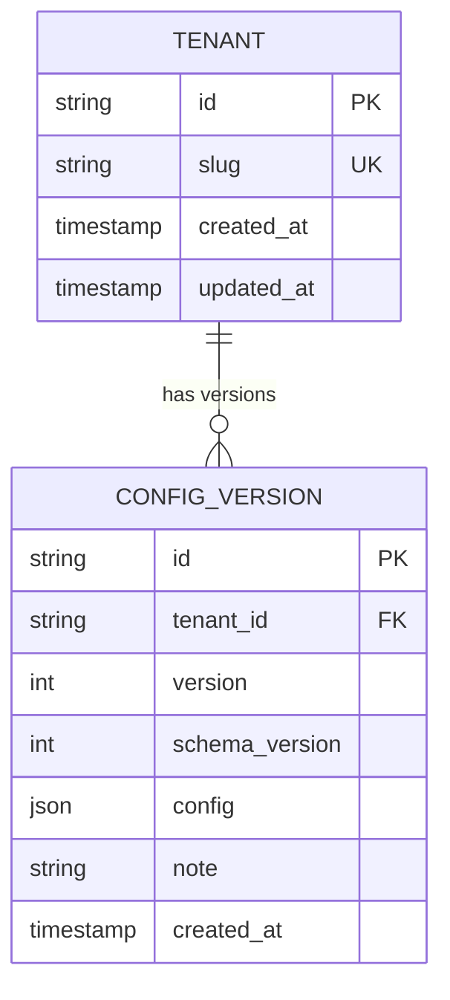

# Strategy A — JSON Blob

The entire tenant configuration is stored as a single JSON document in one column. Each save creates a new `ConfigVersion` row with the full config blob. No sub-tables exist.

---

## ERD



### Key design decisions

- `CONFIG_VERSION.config` — the full tenant configuration as a single JSON document. Always read and written as one unit.
- `CONFIG_VERSION.schema_version` — an integer that tracks the shape of the `config` JSON. Incremented whenever a breaking change is made to the config structure. Used by the migration layer to transform old blobs to the current shape at read time.
- **Current config** — the `CONFIG_VERSION` row with the highest `version` for a given `tenant_id`. No separate pointer column is needed.
- **Rollback** — insert a new `CONFIG_VERSION` row copying the target row's `config` JSON. History rows are never mutated or deleted.

---

## Config JSON Shape

```ts
type TenantConfig = {
  branding: {
    companyName: string
    logoUrl: string
    primaryColor: string
    secondaryColor: string
  }
  claimTypes: {
    [type in ClaimType]?: {
      requiredDocs: string[]
      optionalDocs: string[]
    }
  }
  approvalRules: {
    autoApprovalThreshold: number
    tiers: Array<{
      minAmount: number
      maxAmount: number | null
      approverRole: string
    }>
  }
  notifications: {
    [event in NotificationEvent]?: {
      channels: NotificationChannel[]
      emailTemplate: string | null
    }
  }
  sla: {
    [type in ClaimType]?: {
      targetDays: number
      escalateTo: string
    }
  }
  customFields: Array<{
    name: string
    fieldKey: string
    type: "text" | "number" | "select"
    required: boolean
    options: string[]
  }>
}
```

The Zod schema derived from this type is the single validation gate. Every write to `CONFIG_VERSION.config` passes through `TenantConfigSchema.parse()` before the row is inserted. Invalid shapes are rejected at the application boundary.

---

## Advantages

### 1. Versioning is trivially simple
A save is one `INSERT` into one table. A rollback is one `INSERT` copying an existing row's `config` column. Loading any version is one `SELECT` by `id`. No transactions spanning multiple tables, no FK cascades, no coordination across sub-tables.

### 2. Adding a new config dimension requires no migration
A new config section (e.g., `currencySettings`) is added to the Zod schema and the frontend form. The database schema is unchanged. Old rows simply lack the new field; the Zod schema fills in a default at read time. Zero downtime, zero migration file.

### 3. Diff is a JSON comparison
Comparing two versions is `deepDiff(versionA.config, versionB.config)` — one function call on two objects already in memory. No multi-table join to reconstruct both configs first.

### 4. Config is always one read
`SELECT config FROM config_version WHERE id = ?` — one indexed lookup, one row, full config. No joins, no N+1 risk, no partial load.

### 5. Minimal code surface
Two tables, two Prisma models, two repository functions (`save`, `loadVersion`). The entire persistence layer is small and easy to reason about.

---

## Trade-offs

### 1. No DB-level type enforcement inside the JSON
PostgreSQL stores the JSON column as opaque text (or JSONB binary). It cannot enforce that `approvalRules.tiers` is always an array, or that `sla.OUTPATIENT.targetDays` is a positive integer. A bug that bypasses the Zod validation layer could store malformed data silently.

**Mitigation:** Make the Zod parse the *only* path to a write. Never insert into `CONFIG_VERSION` from a raw query or migration script without parsing first.

### 2. Cross-field queries require JSON operators
Querying across the JSON config at the DB level requires PostgreSQL's JSONB operators:
```sql
-- Tenants with auto-approval threshold above 10,000
SELECT slug FROM tenant t
JOIN config_version cv ON cv.tenant_id = t.id
WHERE cv.version = (SELECT MAX(v) FROM config_version WHERE tenant_id = t.id)
  AND (cv.config -> 'approvalRules' ->> 'autoApprovalThreshold')::int > 10000
```
Verbose, requires casting, and harder to index than a standard column.

### 3. Schema evolution requires a migration layer
When a breaking change is made to the config shape (a field renamed, a section restructured), old rows have the old shape. Reading them against the new Zod schema will throw a parse error unless a migration function handles the transformation.

**Mitigation:** The `schema_version` field on every config row enables a chain of migration functions:

```ts
function migrateConfig(raw: unknown): TenantConfig {
  const v = (raw as any).schemaVersion ?? 1
  if (v < 2) raw = migrateV1toV2(raw)
  if (v < 3) raw = migrateV2toV3(raw)
  return TenantConfigSchema.parse(raw)
}
```

Old rows are migrated in memory on read. The database is never updated retroactively — history rows stay as they were when saved.

### 4. Partial updates require a full read-modify-write cycle
Changing only the branding requires reading the full config JSON, merging the change in application code, and writing the entire blob back. With normalized tables, only the `BRANDING` row is touched.

---

## Scalability Issues and Solutions

### Issue 1 — Full table scan to find the current version
Without optimization, every read of the current config requires:
```sql
SELECT * FROM config_version
WHERE tenant_id = ?
ORDER BY version DESC
LIMIT 1
```
At large version counts, `ORDER BY version DESC` on an unindexed column is slow.

**Solution: Composite index on `(tenant_id, version DESC)`**
```sql
CREATE INDEX idx_config_version_tenant_version
ON config_version(tenant_id, version DESC);
```
The planner uses this index to return the first row immediately — no full scan. For an even faster path, add `TENANT.current_version_id` (a FK pointer to the latest version) and update it on every save.

### Issue 2 — JSONB queries are slow without a GIN index
Ad-hoc queries using JSON path operators (`->`, `->>`, `@>`) perform sequential scans unless the column is indexed.

**Solution: GIN index on the `config` column**
```sql
CREATE INDEX idx_config_version_config_gin
ON config_version USING GIN (config);
```
GIN indexes accelerate `@>` (contains) and `?` (key exists) operators. For deeply nested path queries, use a generated column:
```sql
ALTER TABLE config_version
ADD COLUMN auto_approval_threshold int
GENERATED ALWAYS AS
  ((config -> 'approvalRules' ->> 'autoApprovalThreshold')::int) STORED;

CREATE INDEX idx_auto_approval ON config_version(auto_approval_threshold);
```
The generated column is a standard indexed integer — no JSON operators needed at query time.

### Issue 3 — `processClaim()` reads the DB on every call
At high claim volume, a DB round trip per claim adds up.

**Solution: In-memory config cache per tenant**
```ts
const configCache = new Map<string, { version: number; config: TenantConfig }>()

async function getConfig(tenantId: string): Promise<TenantConfig> {
  const cached = configCache.get(tenantId)
  if (cached) return cached.config
  const row = await db.configVersion.findFirst({
    where: { tenantId },
    orderBy: { version: 'desc' }
  })
  const config = migrateConfig(row.config)
  configCache.set(tenantId, { version: row.version, config })
  return config
}
```
Cache is invalidated on every save. In serverless environments (Vercel, Fly.io), cache lives per instance — acceptable for this scale since configs change rarely.

For multi-instance deployments at scale, replace the in-memory `Map` with Redis. The invalidation signal on save publishes to a Redis pub/sub channel; all instances clear the relevant tenant's cache entry.

### Issue 4 — Config history table grows unbounded
Append-only inserts mean the `config_version` table grows indefinitely. At millions of saves, queries for history pagination become slow.

**Solution: Retention policy + archival**
Keep only the last N versions (e.g., 50) in the live table. Archive older rows to a `config_version_archive` table. History UI shows live versions by default and fetches from the archive on demand.

For PostgreSQL, range-partition `config_version` by `created_at`. The planner prunes old partitions automatically when querying recent history.

### Issue 5 — Large JSON blobs increase row size and I/O
If configs grow large (many custom fields, many claim types with long document lists), JSONB storage expands and row I/O increases.

**Solution: JSONB compression is automatic**
PostgreSQL stores JSONB in a binary format that is more compact than text JSON and compresses repeated keys. For very large blobs, PostgreSQL's TOAST mechanism transparently stores out-of-line values. No application-level action needed — the storage engine handles it.

If configs regularly exceed several kilobytes, consider the split-column hybrid (one JSONB column per config section) to limit per-read I/O to only the sections needed for a given operation.
