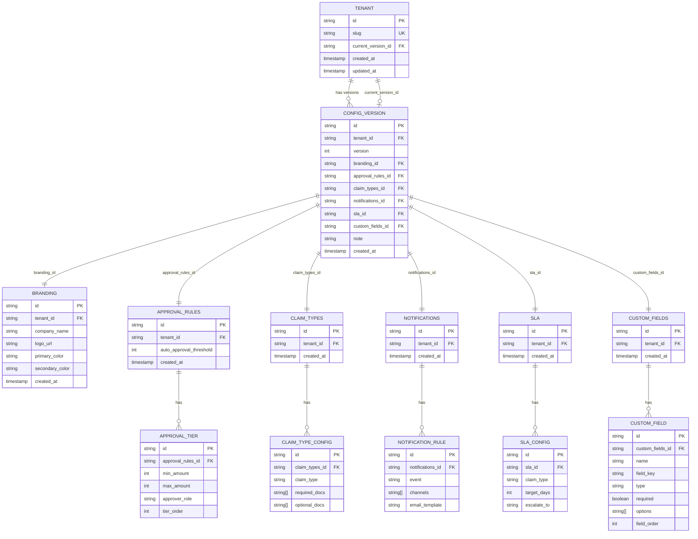

# Strategy B — Fully Normalized

Each section of the tenant configuration lives in its own table. `CONFIG_VERSION` acts as a version header that holds FK pointers to the active snapshot row for each section. Sections only get a new row when *they actually change* — unchanged sections are reused across versions by pointing to the same snapshot row.

---

## ERD



---

## Key Design Decisions

### Section snapshots, not version-owned rows
Each section table (`BRANDING`, `APPROVAL_RULES`, `CLAIM_TYPES`, etc.) belongs to a `tenant_id`, not a `config_version_id`. A section row represents one immutable snapshot of that section for a given tenant. `CONFIG_VERSION` holds FK pointers to one snapshot per section.

When a save occurs:
- Only the **changed sections** get a new snapshot row (and new child rows if applicable).
- Unchanged sections are **reused** — the new `CONFIG_VERSION` points to the same snapshot row as the previous version.

This eliminates the duplication problem from the original design where every save inserted new rows into all 7 sub-tables even if only one section changed.

### Immutable snapshots
Section rows are never updated or deleted. Once inserted, a snapshot row is permanent. This makes every `CONFIG_VERSION` a stable, auditable point-in-time record for each section.

### Section collection pattern
Sections with multiple rows (approval tiers, claim types, notification rules, SLA configs, custom fields) use a two-level structure:
- A **snapshot header** row (`APPROVAL_RULES`, `CLAIM_TYPES`, etc.) scoped to `tenant_id`
- **Child rows** (`APPROVAL_TIER`, `CLAIM_TYPE_CONFIG`, etc.) scoped to the snapshot header `id`

When that section changes, a new header row is inserted along with new child rows. The old header and its children remain untouched.

### Current version pointer
`TENANT.current_version_id` is a FK to the latest `CONFIG_VERSION`. Updated on every save. Eliminates the `MAX(version)` subquery on every read.

### Order preservation
`APPROVAL_TIER.tier_order` and `CUSTOM_FIELD.field_order` store explicit ordering integers. Never rely on `created_at` or row insertion order for display order.

---

## Save Logic — Which Sections Get New Rows

On every config save, the application compares each section of the incoming config against the section pointed to by the current `CONFIG_VERSION`. Only sections that differ produce new rows:

```
incoming.branding      ≠ current.branding      → INSERT new BRANDING row
incoming.approvalRules = current.approvalRules  → reuse current APPROVAL_RULES id
incoming.claimTypes    ≠ current.claimTypes     → INSERT new CLAIM_TYPES + CLAIM_TYPE_CONFIG rows
...
```

The new `CONFIG_VERSION` row is then inserted pointing to the new snapshot IDs for changed sections and the existing snapshot IDs for unchanged sections.

---

## Advantages

### 1. No row duplication for unchanged sections
If 20 saves touch only approval rules, there are 20 `APPROVAL_RULES` + `APPROVAL_TIER` rows but still only 1 `BRANDING` row for that tenant. History is accurate; storage is efficient.

### 2. DB-level type enforcement
Every field has a declared type, nullability constraint, and length limit enforced by PostgreSQL. A bad write is rejected at the database level before it touches a row.

### 3. Partial updates touch only changed sections
A branding-only change inserts one `BRANDING` row and one `CONFIG_VERSION` row — nothing else. The transaction is small and fast.

### 4. Field-level queries without JSON operators
Standard SQL across any field:
```sql
-- All tenants with auto-approval threshold above 10,000
SELECT t.slug FROM tenant t
JOIN config_version cv ON cv.id = t.current_version_id
JOIN approval_rules ar ON ar.id = cv.approval_rules_id
WHERE ar.auto_approval_threshold > 10000
```
No JSON path expressions, no casting, no GIN indexes.

### 5. Standard indexing on any field
Every column in every table can be indexed normally. No JSONB operators or generated columns needed.

### 6. Schema changes are explicit and auditable
Adding a new config section produces a real migration file visible in version control. The change is reviewable and reversible.

---

## Trade-offs

### 1. Save logic is more complex
The application must diff each section before saving to determine which snapshots need new rows. This is logic that does not exist in the JSON blob approach (which always writes the full config unconditionally).

### 2. Loading the full config is a multi-table join
Reconstructing the full config for any version requires joining `CONFIG_VERSION` to 6 section header tables and then joining each header to its child rows. ~12 tables in a single query for a full load.

### 3. Schema evolution requires migrations
Adding a new config section = new snapshot header table + new child table + new FK column on `CONFIG_VERSION` + migration. Additive field within an existing section = `ALTER TABLE` + migration. In the JSON blob approach, additive changes require no migration.

### 4. Largest code surface of all strategies
12 tables, 12 Prisma models, repository functions for each section, and more test fixtures. For a timed challenge this is a significant overhead compared to the 2-table JSON blob approach.

### 5. Diff requires resolving section pointers first
Comparing version 3 and version 7 requires loading both `CONFIG_VERSION` rows to get their section FKs, then loading each section's child rows. Two-phase reads instead of one.

---

## Scalability Issues and Solutions

### Issue 1 — Multi-table join on every config read
Loading the full config requires joining 12 tables. At high `processClaim()` volume this compounds.

**Solution A: FK indexes on every join column**
```sql
CREATE INDEX idx_cv_branding ON config_version(branding_id);
CREATE INDEX idx_cv_approval_rules ON config_version(approval_rules_id);
CREATE INDEX idx_cv_claim_types ON config_version(claim_types_id);
CREATE INDEX idx_approval_tier_rules ON approval_tier(approval_rules_id);
CREATE INDEX idx_claim_type_config_types ON claim_type_config(claim_types_id);
-- ... same for all FK columns
```

All joins execute on indexed FKs. The planner resolves the full config in one pass.

**Solution B: In-memory config cache per tenant**
Cache the fully assembled config object per tenant after the first load. Invalidate only when `TENANT.current_version_id` changes (i.e., on every save). The 12-table join is paid once per save, not once per claim.

### Issue 2 — Save transaction size varies by number of changed sections
A save that changes all 6 sections inserts ~20+ rows across 12 tables in one transaction. Under high write concurrency this increases lock contention.

**Solution: New snapshot rows have no readers yet**
Since snapshots are immutable and the new `CONFIG_VERSION.id` doesn't exist until commit, no existing reader holds a lock on the new rows. Lock contention is limited to the single-row update of `TENANT.current_version_id`, which is extremely fast.

### Issue 3 — Snapshot tables grow unbounded over time
With many saves, section tables accumulate many snapshot rows per tenant. Queries that scan all snapshots for a tenant grow slower.

**Solution: Snapshot archival policy**
Keep only the last N `CONFIG_VERSION` rows (and their referenced snapshots) in the live tables. Archive older rows to `*_archive` tables. Active queries stay fast; old versions are still queryable from the archive when needed.

Identify orphaned snapshots (no longer referenced by any `CONFIG_VERSION`) with:
```sql
SELECT id FROM branding b
WHERE NOT EXISTS (
  SELECT 1 FROM config_version cv WHERE cv.branding_id = b.id
);
```
Archive or delete these rows during off-peak maintenance windows.

### Issue 4 — Diff requires two-phase loading
Loading two versions for a diff requires first fetching both `CONFIG_VERSION` rows for their FK pointers, then fetching all section rows for both versions.

**Solution: Batch section loads across both versions**
After fetching both `CONFIG_VERSION` rows, collect all unique section IDs across both versions and batch-load them:

```sql
SELECT * FROM branding WHERE id IN ('branding-v3-id', 'branding-v7-id');
SELECT * FROM approval_rules WHERE id IN ('rules-v3-id', 'rules-v7-id');
-- ...
```

6 batched queries cover all sections for both versions. Split client-side by `id` to reconstruct each version's full config.

### Issue 5 — Cross-tenant analytical queries (strength, not issue)
"Find all tenants with MATERNITY enabled and SLA > 10 days" is straightforward SQL — no JSON operators needed:

```sql
SELECT t.slug FROM tenant t
JOIN config_version cv ON cv.id = t.current_version_id
JOIN claim_types ct ON ct.id = cv.claim_types_id
JOIN claim_type_config ctc ON ctc.claim_types_id = ct.id
JOIN sla s ON s.id = cv.sla_id
JOIN sla_config sc ON sc.sla_id = s.id
WHERE ctc.claim_type = 'MATERNITY'
  AND sc.claim_type = 'MATERNITY'
  AND sc.target_days > 10
```

This is where full normalization has a decisive advantage over JSON blob at scale — analytics and cross-tenant reporting are standard SQL with standard indexes.
